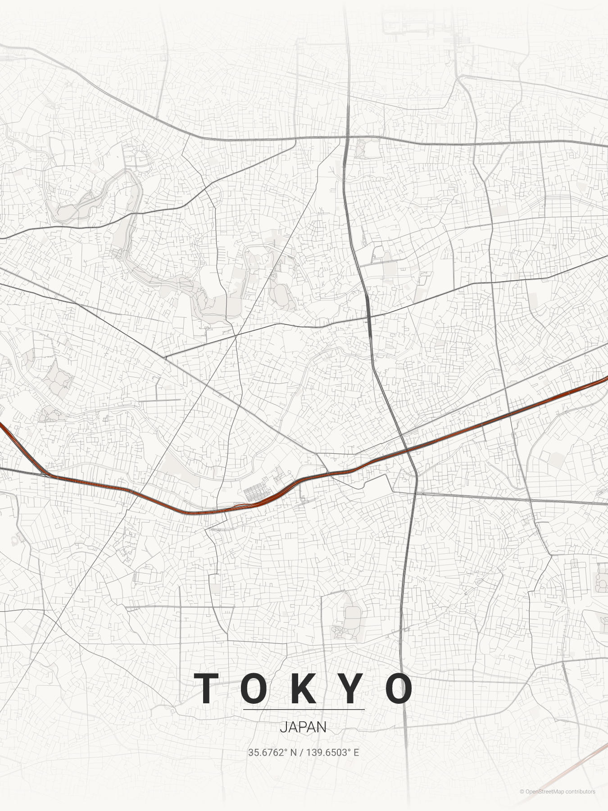

# Place Print Journey (Next.js)

Place Print is a full-stack Next.js app that generates printable city map posters from OpenStreetMap data.

This README is for the web app in this repository (not the legacy Python tooling).




## What It Does

- Theme-first poster flow: choose a theme, set details, generate, download.
- Generates posters as `png`, `svg`, or `pdf`.
- Supports either:
  - city + country geocoding (Nominatim), or
  - explicit latitude + longitude center.
- Renders roads, water, parks, title/subtitle, coordinates, and optional center marker.
- Loads themes from `themes/*.json` (20 built-in themes).
- Caches geocoding/OSM responses and generated assets on disk.

## Tech Stack

- Next.js 14 (App Router)
- React 18
- TypeScript
- Node.js runtime for API routes
- OpenStreetMap providers:
  - Nominatim for geocoding
  - Overpass for roads/water/parks

## Quick Start

### Requirements

- Node.js 18+ (Node.js 20 recommended)
- npm

### Run locally

```bash
npm install
npm run dev
```

Open: [http://localhost:3000](http://localhost:3000)

## App Journey

1. **Themes** (`/`)
Select a theme from generated mini-previews.

2. **Details** (`/details`)
Set location, map center options, marker, size, and export format.

3. **Generating** (`/generating`)
Posts payload to the backend generator.

4. **Result** (`/result`)
Shows outputs and download/open links.

## npm Scripts

```bash
npm run dev       # start local dev server
npm run build     # production build
npm run start     # run production server
npm run lint      # Next.js lint
npm run typecheck # TypeScript check
```

## Environment Variables

All variables are optional. If omitted, sane defaults are used.

| Variable | Default | Purpose |
|---|---|---|
| `LOG_LEVEL` | `info` | `debug`, `info`, `warn`, or `error` logging |
| `POSTERS_DIR` | `posters` (local) / `/tmp/posters` (serverless fallback) | Output directory for generated files |
| `CACHE_DIR` | `cache` (local) / `/tmp/cache` (serverless fallback) | Cache directory for API responses/assets |
| `NOMINATIM_SEARCH_URL` | `https://nominatim.openstreetmap.org/search` | Geocoding endpoint |
| `OVERPASS_API_URLS` | `https://overpass-api.de/api/interpreter,https://overpass.kumi.systems/api/interpreter,https://overpass.private.coffee/api/interpreter` | Comma-separated Overpass endpoints (failover list) |
| `OVERPASS_API_URL` | none | Single endpoint fallback if `OVERPASS_API_URLS` is not set |
| `OVERPASS_MAX_RETRIES` | `3` | Retry attempts for Overpass failures |
| `OVERPASS_RETRY_BASE_MS` | `800` | Exponential backoff base delay |
| `OVERPASS_QUERY_TIMEOUT_SECONDS` | `60` | Overpass-side timeout hint |
| `HTTP_TIMEOUT_MS` | `45000` | Client-side request timeout |
| `OSM_USER_AGENT` | `city_map_poster_js` | User-Agent for OSM API requests |
| `GOOGLE_FONTS_USER_AGENT` | browser-like default | User-Agent for Google Fonts CSS/font fetch |

On Netlify/AWS Lambda, only `/tmp` is writable. Set `POSTERS_DIR` and `CACHE_DIR` to absolute `/tmp/...` paths in your Netlify environment variables.

Example `.env`:

```bash
LOG_LEVEL=debug
POSTERS_DIR=posters
CACHE_DIR=cache
NOMINATIM_SEARCH_URL=https://nominatim.openstreetmap.org/search
OVERPASS_API_URLS=https://overpass-api.de/api/interpreter,https://overpass.kumi.systems/api/interpreter,https://overpass.private.coffee/api/interpreter
OVERPASS_MAX_RETRIES=3
OVERPASS_RETRY_BASE_MS=800
OVERPASS_QUERY_TIMEOUT_SECONDS=60
HTTP_TIMEOUT_MS=45000
OSM_USER_AGENT=city_map_poster_js
```

## API

### `GET /api/themes`

Returns all themes loaded from `themes/*.json`.

### `POST /api/posters`

Generates one or more posters.

Request rules:

- Provide either:
  - `city` + `country`, or
  - `latitude` + `longitude`
- Do not provide both location modes at once.
- `format` must be one of: `png`, `svg`, `pdf`.

Payload fields:

| Field | Type | Required | Notes |
|---|---|---|---|
| `city` | string | conditional | with `country` |
| `country` | string | conditional | with `city` |
| `latitude` | string | conditional | with `longitude` |
| `longitude` | string | conditional | with `latitude` |
| `theme` | string | no | defaults to `terracotta` |
| `allThemes` | boolean | no | generate every theme when `true` |
| `distance` | number | no | meters, min 100, default 18000 |
| `width` | number | no | inches, clamped to 1..20 |
| `height` | number | no | inches, clamped to 1..20 |
| `format` | string | no | `png` (default), `svg`, `pdf` |
| `showMarker` | boolean | no | default `true` |
| `markerColor` | string | no | hex color, default `#d62828` |
| `markerIcon` | string | no | `none`, `dot`, `plus`, `star` |
| `markerSize` | string | no | `small`, `medium` (default), `large` |
| `displayCity` | string | no | title override |
| `displayCountry` | string | no | subtitle override |
| `countryLabel` | string | no | fallback subtitle override |
| `fontFamily` | string | no | Google Fonts family (weights 300/400/700) |

Example:

```bash
curl -X POST http://localhost:3000/api/posters \
  -H "Content-Type: application/json" \
  -d '{
    "city": "Paris",
    "country": "France",
    "theme": "pastel_dream",
    "distance": 9000,
    "width": 12,
    "height": 16,
    "format": "png",
    "showMarker": true,
    "markerColor": "#d62828",
    "markerIcon": "dot",
    "markerSize": "medium"
  }'
```

Response shape:

```json
{
  "ok": true,
  "outputs": [
    {
      "relativePath": "posters/paris_pastel_dream_20260209_223308.png",
      "fileName": "paris_pastel_dream_20260209_223308.png",
      "format": "png",
      "downloadUrl": "/api/posters/file?path=posters%2Fparis_pastel_dream_20260209_223308.png",
      "previewUrl": "/api/posters/file?path=posters%2Fparis_pastel_dream_20260209_223308.png"
    }
  ],
  "logs": "...",
  "stderr": ""
}
```

### `GET /api/posters/file?path=posters/<relative-path>`

Streams generated poster files (`png`, `svg`, `pdf`) from `POSTERS_DIR`.

### `GET /api/showcase`

Returns the theme gallery metadata + available preview links.

### `POST /api/showcase` (development only)

Generates missing (or all) showcase previews in `public/posters/templates`.

Request body:

```json
{ "regenerate": false }
```

## Themes

Themes are JSON files in `themes/`. The file name (without `.json`) is the theme id used by the API and UI.

Example theme file:

```json
{
  "name": "My Theme",
  "description": "Custom palette",
  "bg": "#F5EDE4",
  "text": "#8B4513",
  "gradient_color": "#F5EDE4",
  "water": "#A8C4C4",
  "parks": "#E8E0D0",
  "road_motorway": "#A0522D",
  "road_primary": "#B8653A",
  "road_secondary": "#C9846A",
  "road_tertiary": "#D9A08A",
  "road_residential": "#E5C4B0",
  "road_default": "#D9A08A"
}
```

Add a new `themes/<id>.json` file and it will appear in `/api/themes` and the app UI.

## Output and Cache Layout

```text
posters/                         # generated outputs
public/posters/templates/        # showcase preview outputs
public/posters/showcase_manifest.json # showcase metadata
cache/                           # geocoding and Overpass cache files
fonts/cache/                     # downloaded Google font files
```

Generated file pattern:

```text
{city_slug}_{theme}_{YYYYMMDD_HHMMSS}.{png|svg|pdf}
```

## Troubleshooting

- `Overpass request failed: HTTP 504`
  - Reduce `distance`.
  - Increase `OVERPASS_QUERY_TIMEOUT_SECONDS`.
  - Use reliable custom Overpass endpoints in `OVERPASS_API_URLS`.
- Validation errors from `POST /api/posters`
  - Ensure location mode is valid (city/country OR lat/lon, not both).
  - Ensure `format` is `png`, `svg`, or `pdf`.
- Missing preview cards in theme gallery
  - In development, use "Generate Missing Previews" (calls `POST /api/showcase`).

## Project Structure

```text
app/
  api/
    posters/            # generation endpoint
    posters/file/       # secure file streaming endpoint
    showcase/           # theme preview manifest + generator
    themes/             # theme listing endpoint
  _components/          # multi-step UI
  _lib/poster/          # geocoding, OSM fetch, rendering, validation, storage
themes/                 # theme definitions (JSON)
posters/                # generated outputs
public/posters/         # showcase previews + manifest
cache/                  # request cache
fonts/                  # bundled + cached fonts
```

## License

MIT. See `LICENSE`.
